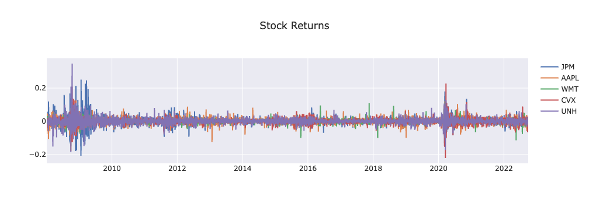
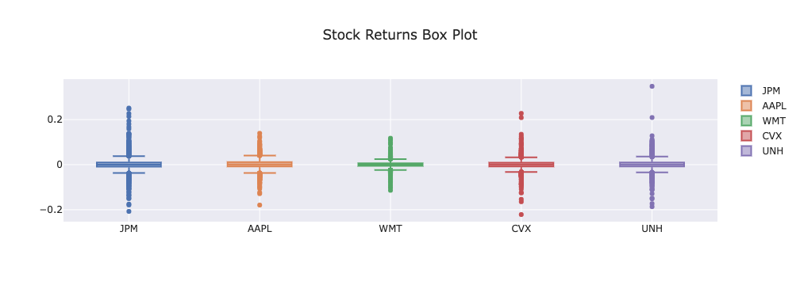
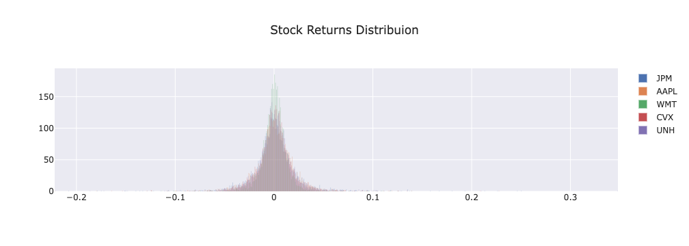
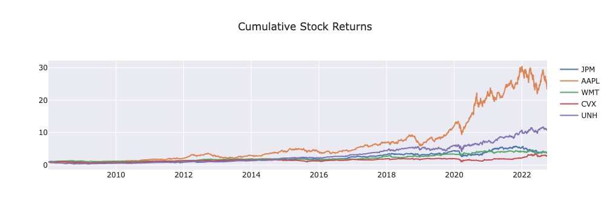
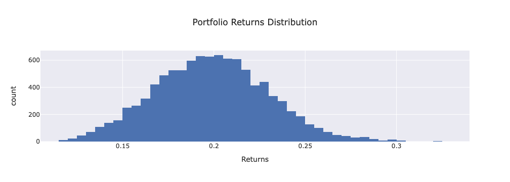
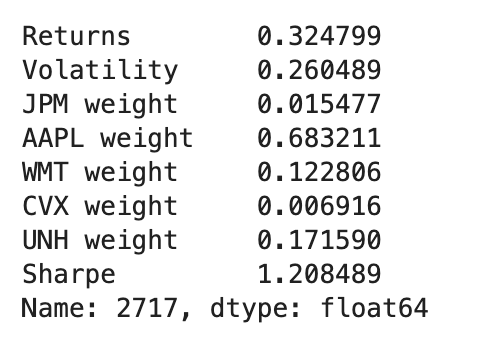

# portfolio-optimizer
UTOR: FinTech Bootcamp - Project 1: Portfolio Optimizer

## Stock Dataframe graphs/Visualization

### Stock Returns (2008-2022)

### Cumulative Stock Returns (2008-2022)

### Optimal Portfolio Weights Calculation

Relationship between stocks

Risk Return

Distribution of 10000 portfolios returns 

