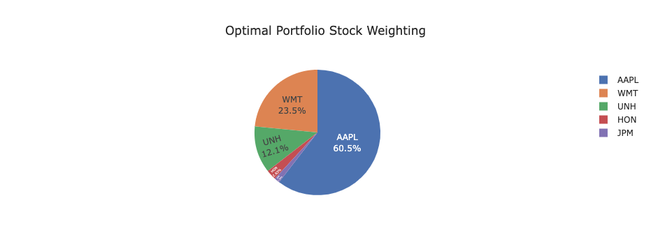
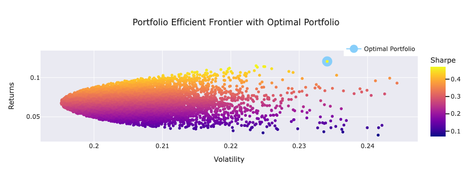

# portfolio-optimizer
UTOR: FinTech Bootcamp - Project 1: Portfolio Optimizer

# Investigated Optimal Weighted Portfolio for High and Low Cap Stock Against the DOW

market pic (bull vs bear)

# Background

Brief description of DOW – what stocks/industries values etc…
Put DOW Jones Stock Table with Stock Mkt Cap and Industries

# Objective

Investigated Optimal Weighted Portfolio for High and Low Cap Stock Against the DOW

# Collaborators

Aizhen

# Technologies Used

Aizhen

# Steps

High Cap

Low Cap

# Results

## High Cap

Full Data Set

Truncated

## Low Cap

Truncated

# Conclusion

