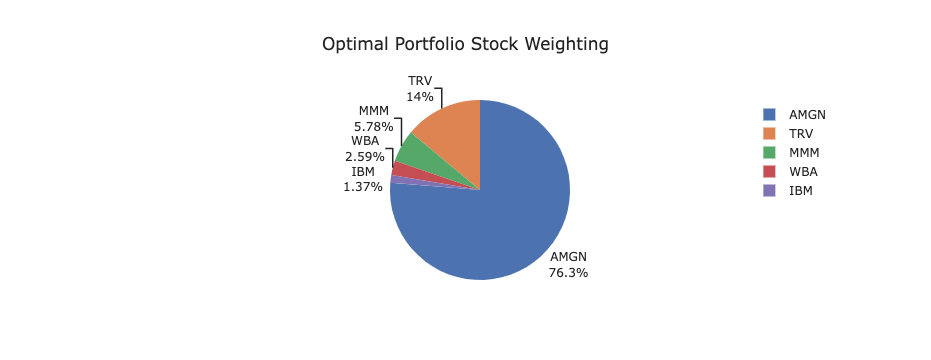

# **Arrow-Up Capital**

 **UTOR: FinTech Bootcamp - Project 1: Portfolio Optimizer**
=======

## **Research Question**

Would an Optimally constructed portfolio of High Cap stocks perform better than a similarly constructed portfolio of Low Cap stocks over the last year (Sep-21 to Sep-22)?

---
## **Abstract**

We Investigated the performance of an Optimally Constructed Portfolio of High Caps Stocks against the DOW JONES Index for a 1 year investment horizon. A simialr analysis was done for an Optimal Portfolio of Low Cap Stocks and following this, we compared the results for the two stock portfolio's (High Cap vs. Low Cap) to determine which of the two would have yielded a higher return over the invested period.

Our Analysis shows that while the optimally constructed porftolio of High Cap stocks performed significantly better than Low Cap stocks for the in-sample period (Jan-2008 to Sep-2021), the results for the out-of-sample period (Sep-21 to Sep-22), were not as promising with both portfolio's yielding similar returns. 

In addition, when comparing the portfolios to the Dow Jones Index (Benchmark), both porfolio's out performed the benchmark for the in-sample period but produced comparable results to the benchmark for the out-of-sample analysis. 

---
## **Background**

    

The Dow Jones Industrial Average, Dow Jones, or simply the Dow, is a stock market index of 30 prominent companies listed on stock exchanges in the United States. The DJIA is one of the oldest and most commonly followed equity indices.

Shares are weighted by their market cap by taking their current price multiplied by their shares outstanding.

Currently the index is comprised of stocks across 9 sectors with Apple (AAPL) being the highest market capped weight representing 26.16% of the index and Walgreen Boots Alliance Inc (WBA) the lowest at 0.3%.

---
## **Collaborators**

- [Aizhen Dong](https://github.com/JD-Yue)
- [Abuzar Fakhruddin](https://github.com/AbuzarF)
- [Chris Ringwood](https://github.com/KristopherGit)
- [Saibal Saha](https://github.com/saibal-saha)
- [Desi Reddy](https://github.com/Rebel1124)

---
## **Technologies Used**

1. Python
2. Pandas
3. Numpy
4. Plotly
5. Monte Carlo Simulator
6. Yahoo Finance API
7. Jupyter Notebook
8. Streamlit

---
## **Steps**

1) The first stage in defining an optimally weighted portfolio was deciding upon which index to use as a base to pull potential individual stocks from in order to analyze & incorporate into the final portfolio. It was decided that we would utilize the DJI (Dow Jones Industrial Average), as it incorporates a broadly versatile, trusted & large share volume traded group of well entrenched companies. We concluded on reducing the size of the test portfolio to 5 companies for simplicity sake of testing. Additionally, it was agreed upon that to enhance diversification & subjectively reduce intra-index correlation the 5 companies chosen would be from 5 different categorically defined 'industry' types within the DOW JONES (i.e. Managed Health Care, IT, Petroleum, Financial Services, Conglomerate, Retailing etc.). As a result, we decided upon the top market cap stocks (Hi-Cap) within each of their own respective industry to analyze for optimal portfolio weighting. They included JPM (JP Morgan Chase), AAPL (Apple Inc.), WMT (Walmart), HON (Honeywell), & UNH (UnitedHealth).

2) Using these 5 High Cap stocks, we imported their historical stock info via a Yahoo API into a Python Panda's dataframe that included closing stock price data from 2008/01/01-to-2022/09/30. From here, we then calculated the daily-percent change in closing price and created a new 'stock_returns' dataframe. This dataframe was then displayed graphically as a scatter-plot with the Plotly library (Refer to Figure 1).

3) [Note: Additionally, we sliced this historical data to excluded last years stock returns in order to test our optimized portfolio (formed via calculating efficient frontier Sharpe's ratio, as discussed in detail below) vs. the DJI benchmark for 2021-to-2022, to see how our model performed against said benchmark. This sliced dataframe is then applied later on.]

4) The above steps outlined were then repeated for 5 of the lowest market cap industry unique stocks. The five low-cap stocks included for comparison analysis were AMGN (Amgen), IBM (IT), MMM (3M), TRV (Travelers), and WBA (Walgreens Boots Alliance, Inc.). This dataframe (of daily stock returns) was then displayed graphically as a scatter-plot with aid of the Plotly library (Refer to Figure 2).

5) Moreover, in order to compare the optimized portfolio's performance against the DJI benchmark data, we imported '^DJI' indices data via the Yahoo API - in an equivalent process to the 5 high / low cap stocks mentioned above. This data was cleaned, filtered and stored in its own DJI benchmark dataframe.

 

#### <i> Figure 1.</i> <b>High Cap Stock Returns</b>. <i>The above figure illustrates the daily percent change in price of the 'stock_returns' dataframe for JPM, AAPL, WMT, HON & UNH, respectively. Each stock is over-layed ontop of each other and can be filtered & inspected interactively using the Plotly graphing function, with applicable widgets.</i>

 

#### <i> Figure 2.</i> <b>Low Cap Stock Returns</b>. <i>The above figure illustrates the daily percent change in price of the 'stock_returns' dataframe for AMGN, IBM, MMM, TRV, and WBA, respectively. Each stock is over-layed ontop of each other and can be filtered & inspected interactively using the Plotly graphing function, with applicable widgets.</i>

 

6) On-top of using the initial dataframes to derive daily-return plots, box-plot return distribution and histogram normalized distribution visualizations were generated for illustrative purposes.

7) Next, the stock_return dataframe was transformed into a normalized (normalized to set start value = 1) cumulative product dataframe. This was also plotted graphically using Plotly tools.

8) Optimal Portfolio Weights Calculation

   a) First, the co-variance of the original 5 hi-cap stocks is taken by converting the originally source dataframe into a co-variance comparison matrix and adjusted for high volatility as a function of time duration by applying a 'lambda x: np.log(1+x)' normalization formula to the percent change price data. A heatmap matrix of the co-variance results are then displayed.

   b) Secondly, a correlation matrix is then produced in a similar fashion to the co-variance derivation and is also adjusted for high volatility as a function of the time-duration by applying the 'lambda x: np.log(1+x)' normalization formula. A heatmap matrix of the correlation results are then displayed.

   c) Next, both the benchmark & 5 hi-cap daily pct_change() returns are then normalized and converted to annual_returns / bm_annual_returns using the CAGR (compound annual growth rate) function & again, normalized further with the 'lambda x: np.log(1+x)' formula.

   d) The annualized standard deviation - in this case, synonymously now referred to as 'volatility' - is then calculated for both the benchmark & 5 hi-cap percent daily_returns and normalized by multiplying the resultant by the square root of 252 (\* to account for 252 trading days per year).

   e) Afterwards, both the annualized returns and the annualized volatility for the 5 hi-cap daily are then indexed based on stock ticker, and subsequently concatenated into their own two columned dataframe (column headings being returns & volatility).

   f) Next, empty lists are instantiated to hold a series of p_ret[] (portfolio returns values), p_vol[] (portfolio volatility values), and finally a list to hold soon to be a series of p_weights[] (randomized portfolio stock weights). A for-each loop is then initiated to iterate through the set number of simulated portfolios (num_portfolios = 10000, for the purposes of our project) with variable weighting assigned to each stock. The for-each loop initiates a normalized list of weights corresponding to the equivalent number of assets in a set portfolio (in this case 5). The dot product of the weights array and the annualized returns series is calculated for each randomized weight variable every time the for-each loop cycles. These return values are then appended to the p_ret[] list. Next, the variance for each iteration is calculated, as a product of the previously calculated cov_matrix, and finally converted to an annualized standard deviation or 'volatility' value and appended to the end of the p_vol[] list.

   g) Finally, the totalled p_ret[] (portfolio returns values), p_vol[] (portfolio volatility value) and corresponding individual 5 stock weight values are converted from lists to a dataframe containing 10000 newly created hypothetical 'portfolios' (\*hi-cap and low-cap stocks are calculated separately in their own tables and own separate program files, for organizational purposes). [*Note: as a final entry, a separate column is appended to the final portfolio database containing the calculated Sharpe Ratio for all 10000 portfolios].

   h) Afterwards, a histogram showing the frequency of returns distribution is generated as well as a value series containing the maximum optimal portfolio weighted ratios as a function of the maximum Sharpe Ratio. (Note: This was calculated by searching the iloc index for the row of data - and hence weighted portfolio ratios of all 5 stocks - which contains the maximum Sharpe Ratio value). For the hi-cap stocks this happened to be a sharpe Ratio of 0.76, with returns of 0.18456, a volatility value of 0.230004, JPM weight of 0.613%, AAPL weight of 49.8%, WMT weight of 26.1%, HON weight of 23.3%, and a UNH weight of 23.2% (Refer to Figure 3).

---

## **Results**

### **High Cap**
---

<b>A. Full Data Set</b>

#### <i> Figure 3.</i> <b>High Cap Pie Chart - Optimal Portfolio Weights %</b>. <i>The above pie chart depicts the the optimal weighted portfolio as a percentage of JPM, AAPL, WMT, HON & UNH stocks, respectively.</i>

 

The finalized optimal weighted portfolio dataframe (optimal_port_df) - which contains all 10000 randomized portfolio weight samples, calculated above - is then graphed as a scatter plot. The upper left highlighted natural ridge that forms organically from this plot is colloquially referred to as the efficient frontier. Along this efficient frontier curve, the portfolio that has the maximum Sharpe Ratio value (in this case of the hi-cap stock portfolio) is 0.76, as indicated previously (Refer to Figure 4).

 

#### <i> Figure 4.</i> <b>High Cap Efficient Frontier with Optimal Portfolio Indicated </b>. <i>The above scatter plot depicts the returns (y-axis) and the volatility (x-axis) of all 10000 randomized weighted portfolios consisting of the 5 high-cap DJI stocks JPM, AAPL, WMT, HON & UNH. Highlighted in blue is the optimized return/volatility portfolio with the maximum Sharpe's Ratio value.</i>

 

<b>Historical Cumulative Returns for the Optimal Portfolio (5 High Cap Stocks)</b>

The optimized portfolio ratios are then used to create a new dataframe consisting of all daily returns normalized to the optimized portfolio ratios. This is then converted into a cumulative returns product of all daily returns as an updated dataframe.

The optimized cumulative returns dataframe is then concatenated with the benchmark Dow Jones Industrial (^DJI) cumulative returns over the historical time period as previously discussed. These two cumulative return sets are then graphed using Plotly to give a visual representation of the optimal portfolio's historical performance, relative to the benchmark DJI index (Refer Figure 5).

#### <i> Figure 5.</i> <b>High Cap Optimal Portfolio vs Benchmark Dow Jones Industrial (DJI) Cumulative Historical Performance - Line Graph </b>. <i>The above line plot depicts the returns (y-axis) against time (x-axis) of the optimally weighted portfolio (with maximum Sharpe Ratio value) consisting of the 5 high-cap DJI stocks JPM, AAPL, WMT, HON & UNH vs the benchmark Dow Jones Industrial (DJI).</i>

 

<b>Full Data Descriptive Statistics</b>

Finally, a table of descriptive statistics was formulated utilizing the data from the cumulative product dataframes created earlier. The ouput data to the table compared the optimally weighted portfolio of 5 chosen high cap DJI indices stocks vs the benchmark DJI index. Output data of interest included initial investment (dollar value), ending investment (dollar value), max daily returns, min daily returns, return % (overall), volatility, sharpe ratio, and beta values (Refer to Figure 6).

#### <i> Figure 6.</i> <b>High Cap Optimal Portfolio vs Benchmark Dow Jones Industrial (DJI) Cumulative Historical Performance - Initial Investment Descriptive Statistics Table </b>. <i>The above table displays the initial & ending investment values for an optimally weighted portfolio (with maximum Sharpe's Ratio value) consisting of the 5 high-cap DJI stocks JPM, AAPL, WMT, HON & UNH vs the benchmark Dow Jones Industrial (DJI) for a hypothetical initial capital investment of $10000.</i>

 

<b>Scatter Plot of Daily Returns of Optimal Portfolio vs Benchmark</b>

Afterwards, a scatter plot drawing from the optimal portfolio historic returns vs the benchmark historic returns was then calculated and graphed, again, using the Plotly module. The results indicated a strong positive correlation between both variable inputs.

<b>Monte Carlo Simulation (5 High Cap Stocks)</b>

Next, we adjusted our initial dataframe to run a Monte Carlo Simulation into the future to see what our statistically probable returns could be. For the Monte Carlo Simulation, we imported the MCSimulation module from the MCForecastTools library to and ran the simulation for 'num_simulation' (in this case we set 'num_simulation' == 'number_simulation' = 500) over a 'num_trading_days' (number of trading days, 'num_trading_days' == 252 x years, where years in this case was 5). Therefore, in summary we ran the Monte Carlo simulation for 500 simulations over a period of 252 x 5 = 1260 days. The Monte Carlo simulation then produced a summarized cumulative return statistics output whereby it was determined that there was a 95% chance that an initial investment of $10,000.00 in the portfolio over the next 5 years will end within in the range of $11,538.90 and $57,910.70.

<b>Calculating Optimal Portfolio Weights Using Sliced Dataframe and Optimal Performance For Out of Sample Data</b>

a) The covariance and correlation matrix were then recalculated for the stock return dataframe to exclude the previous years return data.

b) Additionally, the compound annual growth rate (CAGR) had to be recalculated, again, correcting to exclude the previous years return data in order to generate the annual returns for the list of 5 companies chosen.

c) An updated series of annual standard deviation values - or volatility values - were then generated for each of the 5 high cap stocks.

d) As before, both the annual return & volatility values were put into individual columns, and rows were indexed by each individual stock ticker.

e) Again, lists were generated to hold portfolio returns, volatility and weights data. A for-each loop was implemented to generate randomized portfolio weights included in a dot product statement to produce 10000 sets of hypothetical portfolio returns & associated volatility values. These results were then published in a 10000 row dataframe with columns for returns, volatility, JPM weight, AAPL weight, WMT weight, HON weight, UNH weight and Sharpe ratios.

f) Using the aforementioned sliced dataframe a histogram for all simulated portfolio distributions along with a pie graph showing the optimal weighted Sharpe Ratio were generated. Results differ from the previously calculated non-sliced dataframe, however differ slightly. Finalized weighting includes JPM 0.17%, AAPL 53.35%, WMT 25.65%, HON 2.42% and UNH at 18.41% (Refer to Figure 7 & 8).

g) As before, the sliced dataframe information is then used to determine the efficient frontier return/volatility scatter plot, optimal maximum Sharpe's Ratio value of 0.81 is calculated, and the sliced dataframe is then run through a cumulative product transformation (along with the benchmark DJI dataframe sliced data as well) to produce a truncated/sliced optimal weighted vs benchmark cumulative returns line graph.

<b>B. Truncated Data</b>

#### <i> Figure 7.</i> <b>High Cap Pie Chart - Optimal Portfolio Weights % From Sliced Data (Excluding Previous 252 Trading Days)</b>. <i>The above pie chart depicts the the optimal weighted portfolio as a percentage of JPM, AAPL, WMT, HON & UNH stocks, respectively.</i>

 

<b> C. Out of Sample Data</b>

a) The other sliced dataframe that includes only the past 252 trading days was then computed with the optimal weighted values (found using the entire stock return period from 2008-01-01 up until 252 trading days ago (last_year_stock_returns.dot(weights_excl_ly). Cumulative returns were then calculated based on this data and measured relative to the benchmark DJI returns.

b) Using these cumulative dataframes, in-sample (2008-2021) and out-of-sample (last 252 trading days) descriptive statistics tables were then generated for both dataframes. It is interesting to note that based on an initial investment of $10000 with the the in-sample data, the ending investment up until last year would have been $139,732.0, while the benchmark DJI returns would have yielded only $26,315.98. These equate to an equivalent annual compounded return growth rate of 19.41% and 7.29%, respectively. However, based on the out-of-sample dataframes only inclusive of the last 252 trading days, the initial investments would have been reduced to $9,961.43 for the optimal portfolio and $8368.33 for the benchmark DJI. This equates to an equivalent annual compound return growth rate of -0.39% and -16.36%, respectively (Refer to Figure 7).

#### <i> Figure 8.</i> <b>High Cap Optimal Portfolio vs Benchmark Dow Jones Industrial (DJI) Out-of-Sample Cumulative Historical Performance - Initial Investment Descriptive Statistics Table </b>. <i>The above table displays the initial & ending investment values for an optimally weighted portfolio (with maximum Sharpe's Ratio value) consisting of the 5 high-cap DJI stocks JPM, AAPL, WMT, HON & UNH vs the benchmark Dow Jones Industrial (DJI) for a hypothetical initial capital investment of $10000 that began 252 trading days in the past.</i>

 

### **Low Cap**
---
<b>A. Full Data Set</b>

The steps outlined above were repeated verbatim for the following low-cap stock calculations. As a recap, the 5 lowest market cap stocks were chosen internal from the DJI index from unique Industry groups, as outlined in the high-cap stock optimization model. Again, in order to subjectively reduce intra-indices non-correlation and diversify amongst industries. See the following figures below for results pertaining to the 5 lowest marketcap DJI stocks and the optimal portfolio weightings calculated as a result.

#### <i> Figure 9.</i> <b>Low Cap Stock Returns</b>. <i>The above figure illustrates the daily percent change in price of the 'stock_returns' dataframe for AMGN, IBM, MMM, TRV, and WBA, respectively. Each stock is over-layed ontop of each other and can be filtered & inspected interactively using the Plotly graphing function, with applicable widgets.</i>

 

#### <i> Figure 10.</i> <b>Low Cap Efficient Frontier with Optimal Portfolio Indicated </b>. <i>The above scatter plot depicts the returns (y-axis) and the volatility (x-axis) of all 10000 randomized weighted portfolios consisting of the 5 low-cap DJI stocks (AMGN, IBM, MMM, TRV, and WBA). Highlighted in blue is the optimized return/volatility portfolio with the maximum Sharpe's Ratio value.</i>

 

#### <i> Figure 11.</i> <b>Low Cap Optimal Portfolio vs Benchmark Dow Jones Industrial (DJI) Cumulative Historical Performance - Line Graph </b>. <i>The above line plot depicts the returns (y-axis) against time (x-axis) of the optimally weighted portfolio (with maximum Sharpe's Ratio value) consisting of the 5 low-cap DJI stocks (AMGN, IBM, MMM, TRV, and WBA) vs the benchmark Dow Jones Industrial (DJI).</i>

 

 

#### <i> Figure 12.</i> <b>Low Cap Optimal Portfolio vs Benchmark Dow Jones Industrial (DJI) Cumulative Historical Performance - Initial Investment Descriptive Statistics Table </b>. <i>The above table displays the initial & ending investment values for an optimally weighted portfolio (with maximum Sharpe's Ratio value) consisting of the 5 low-cap DJI stocks (AMGN, IBM, MMM, TRV, and WBA) vs the benchmark Dow Jones Industrial (DJI) for a hypothetical initial capital investment of $10000.</i>

 

<b>B. Truncated Data</b>

#### <i> Figure 13.</i> <b>Low Cap Pie Chart - Optimal Portfolio Weights % From Sliced Data (Excluding Previous 252 Trading Days)</b>. <i>The above pie chart depicts the the optimal weighted portfolio as a percentage of AMGN, IBM, MMM, TRV, and WBA stocks, respectively.</i>

 

#### <i> Figure 14.</i> <b>Low Cap Optimal Portfolio vs Benchmark Dow Jones Industrial (DJI) Out-of-Sample Cumulative Historical Performance - Initial Investment Descriptive Statistics Table </b>. <i>The above table displays the initial & ending investment values for an optimally weighted portfolio (with maximum Sharpe's Ratio value) consisting of the 5 low-cap DJI stocks AMGN, IBM, MMM, TRV, and WBA vs the benchmark Dow Jones Industrial (DJI) for a hypothetical initial capital investment of $10000 that began 252 trading days in the past.</i>

 

---

## **Conclusion**

#### **A. Complete Data (2008-2022)**

|     Statistic	     |  Low Cap   |	 High Cap   |  Benchmark |
|--------------------|------------|-------------|------------|
| Initial Investment | $10,000.00 | $10,000.00  | $10,000.00 |
| Ending Investment	 | $60,305.57 |	$178,648.02 | $22,022.08 |
|  Max Daily Return  |	 11.46%	  |   18.76%    |   11.37%   |
|  Min Daily Return	 |   -9.49%   |	 -15.95%    |  -12.93%   |
|      Return	     |   12.04%   |   19.60%    |    5.50%   |
|    Volatility      |	 23.41%	  |   24.61%    |   19.87%   |
|   Sharpe Ratio     |	  0.47	  |    0.76	    |    0.23    |
|        Beta        |	  0.81    |	   0.91	    |     1      |

For the period of 2008 to 2022, both low cap and high cap portfolios (with stocks of optimal weights) outperfomed DJI with higher ending investment, percentage of returns and sharpe ratio. The volatility of the portfolios are also higher than that of DJI which indicates the potential to make more money quicky. Their beta is lower than DJI's beta which means that the volatility is within the acceptable range.

#### **B. Truncated (2008-2021)**

|     Statistic	     |  Low Cap   |	 High Cap   |  Benchmark |
|--------------------|------------|-------------|------------|
| Initial Investment | $10,000.00 | $10,000.00  | $10,000.00 |
| Ending Investment	 | $56,418.68 |	$160,922.71 | $26,315.98 |
|  Max Daily Return  |	 11.46%	  |   14.49%    |   11.37%   |
|  Min Daily Return	 |   -9.06%   |	 -14.39%    |  -12.93%   |
|      Return	     |   12.30%   |   20.69%    |    7.29%   |
|    Volatility      |	 22.71%	  |   24.08%    |   19.98%   |
|   Sharpe Ratio     |	  0.5	  |    0.82	    |    0.23    |
|        Beta        |	  0.84    |	   0.91	    |     1      |

-------------------------------------------------------------
Truncated data shows similar results with that of the complete data. The returns of low cap and high cap portfolios are slightly lower than that of the complete data. This shows the impact of Year 2022 (recession starts this year) has on the investments. The returns were reduced during the last year, especially for the high cap portfolio. This can be further supported by the following results.

#### **C. One-Year (2022)**
|     Statistic	     |  Low Cap   |	 High Cap  |  Benchmark |
|--------------------|------------|------------|------------|
| Initial Investment | $10,000.00 | $10,000.00 | $10,000.00 |
| Ending Investment	 | $9,879.44  |	$10,092.75 | $8,368.33  |
|  Max Daily Return  |	  5.49%	  |   4.65%    |   2.81%    |
|  Min Daily Return	 |   -3.90%   |	 -5.61%	   |  -3.94%    |
|      Return	     |   -1.21%	  |   0.93%	   |  -16.36%   |
|    Volatility      |	 17.28%	  |   24.07%   |   18.21%   |
|   Sharpe Ratio     |	  -0.13	  |     0	   |   -0.95    |
|        Beta        |	   0.6    |	   1.11	   |     1      |

The truncated table shows that high cap stocks outperformed low cap stock, thus it seems ideal to invest in high cap stocks. However the last year (actual) result shows that the returns of low cap portfolio, high cap portfolio and DJI are very close and high cap stocks generate very little returns on investment. The performance of low cap portfolio and DJI are within the acceptable range as compared to the historical performance. The performance of high cap portfolio dropped drastically compared to the historical results. This shows that the low cap stocks respond better to the recession 
(U.S. entered a recession in the summer of 2022) than the high cap stocks. Considering the beta of the high cap portfolio (1.11) in the last year, it seems more risky to invest solely in the high cap stocks during recession. Year 2022 marks the beginning of the recession and returns may continue to drop in the future. Thus we suggest to invest in a portfolio with both high cap and low cap stocks in order to maximize the returns and minimize the risks during the period of recession. 

---

## **Postmortem**
Since we were utilizing the Yahoo Finance API to pull out stock data, there were major issues with the cleaning of the data. Much of our difficulties came from the computations and analysis of the optimally constructed portfolio's. In particular, we note the following:

a) Since we fetched our data from Yahoo as opposed to Alpaca, we ran into difficulties with the Monte Carlo Simulation. The script given to us in class makes is specific to the Alpaca API, and according we had to write code to transform our dataframe to match that Alpaca before running the Monte Carlo Simulation. Going foward, it would have been better for us to have written a function to perform the simulation based on the Yahoo Finance API rather than making tranformations to the dataframe.  

b) Since we were using random number generators to randomly allocate weights to our portfolio's another issue we encountered had to do with the sorting of stocks. Since the weights generated were the same, changes to the positioning of stocks in the dataframe resulted in inconsistent results and marginally different optimal portfolios. After much investigation, we were able to identify the issue and resolve the problem by firts sorting the list of stocks before running it through the optimizer. This resulted in us achieving a consistent optimal portfolio regardless of the order in which the stocks are selected.

c) Lastly, since we were using pythons random number generator, we found that if we did not set the seed for this function, we again got inconsistent results for the optimal portfolio. In addition, we also found that running the np.random.random() vs. np.random.rand() functions also produced slights different weights. In addition, we also picked that the seed needed to be set each time the random function was run, setting it once at the beginning was not enough to keep the numbers generated consistent if the function was run more than once. 

In the end, the solution we went with was to to be consistent and use the rand() function and to set the seed (seed(42)), before each run of the function. This fixed our issue and gave us a consistent optimal portfolio on every run.

---

<a href="[http://example.com/](https://rebel1124-optimizer-app-optimizer-quvt0i.streamlitapp.com/)" target="_blank">Portfolio Optimizer App</a>

## **Reference**

1. https://www.investopedia.com/terms/s/sharperatio.asp#toc-what-is-a-good-sharpe-ratio
2. https://ca.finance.yahoo.com
3. https://www.machinelearningplus.com/machine-learning/portfolio-optimization-python-example/
4. https://www.analyticsvidhya.com/blog/2021/04/portfolio-optimization-using-mpt-in-python/
5. https://www.mlq.ai/python-for-finance-portfolio-optimization/
